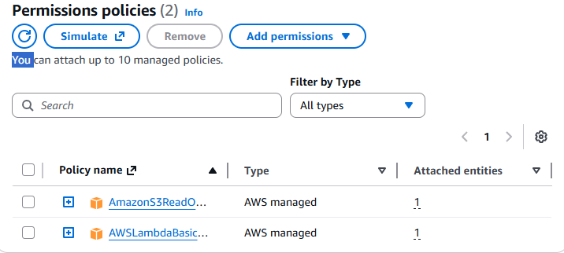
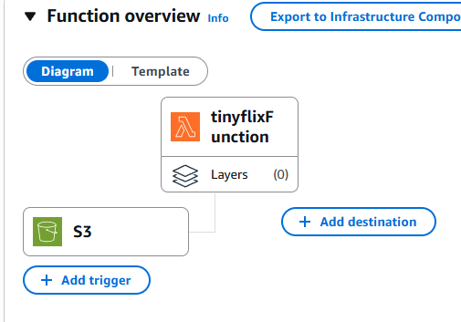
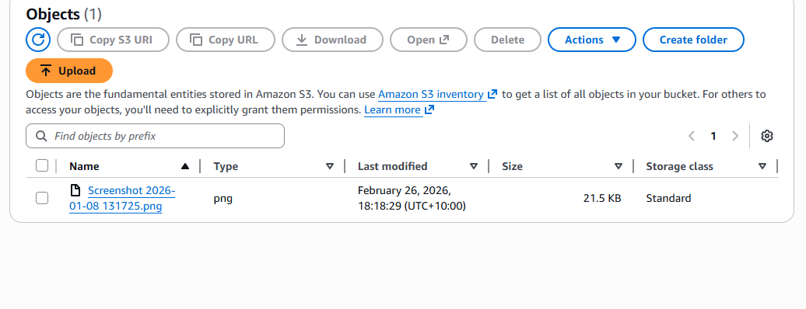
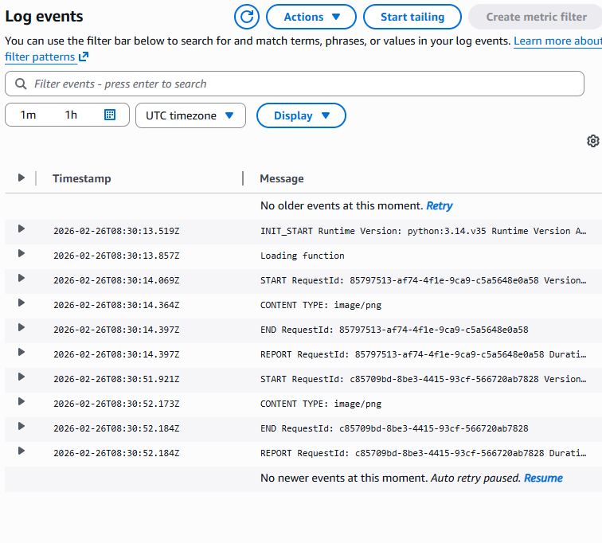

# AWS Serverless Project

## Overview

This project demonstrates a simple AWS serverless architecture using:

- AWS IAM Role  
- AWS Lambda Function  
- Amazon S3 Bucket  

The purpose of this project is to show how AWS services can securely interact with each other using proper role-based access control and event-driven execution.

---

## Architecture

The solution consists of the following components:

### 1. IAM Role
An AWS Identity and Access Management (IAM) role is created to allow the Lambda function to access the required AWS resources securely.

The role includes permissions to:
- Read and/or write objects in the S3 bucket
- Write logs to Amazon CloudWatch

This ensures secure and controlled access following the principle of least privilege.

---

### 2. AWS Lambda Function
The Lambda function performs the core logic of the project.

It is configured to:
- Execute server-side code without managing servers
- Interact with the S3 bucket using the attached IAM role
- Log execution details to CloudWatch

The function can be triggered manually or through S3 events (depending on configuration).

---

### 3. Amazon S3 Bucket
The S3 bucket is used for object storage.

It is configured to:
- Store uploaded files
- Optionally trigger the Lambda function on object creation
- Maintain secure access policies

---

## Workflow

1. A file is uploaded to the S3 bucket (if event trigger is enabled).
2. The S3 event triggers the Lambda function.
3. The Lambda function processes the file.
4. Logs are generated in CloudWatch.
5. Output (if applicable) is stored back in the S3 bucket.

---

## Screenshots

Below are screenshots demonstrating the configuration and deployment:

### IAM Role

### Lambda Function

### S3 Bucket

### Logs

---

## Technologies Used

- AWS IAM
- AWS Lambda
- Amazon S3
- Amazon CloudWatch

---

## Security Considerations

- Principle of least privilege is applied to IAM roles.
- S3 bucket access is restricted via policy.
- Logging and monitoring are enabled via CloudWatch.

---

## How to Deploy

1. Create an S3 bucket.
2. Create an IAM role with appropriate permissions.
3. Create a Lambda function and attach the IAM role.
4. Configure S3 event trigger (optional).
5. Test the workflow by uploading a file.

